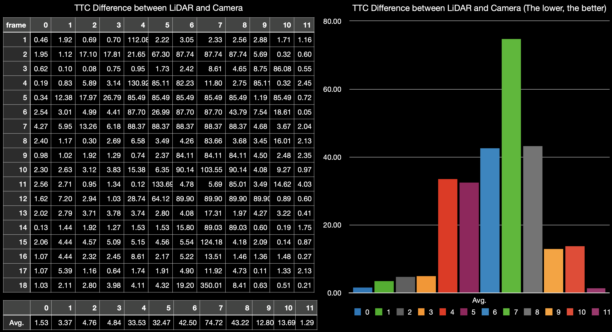

# SFND 3D Object Tracking

## Result

### FP1 : Match 3D Objects
  1. Iterate the bounding boxes of previous frame.
  2. Iterate the bounding boxes of current frame.
  3. Iterate the keypoint matches.
  4. Check the keypoints of match are included in each frame. Then increment the counter.
  5. Make the bbBestMatches with the maximum of counter.

### FP2 : Compute LiDAR-based TTC
  1. Find min X on previous's and current's point cloud on roi. (Remove outlier with IQR)
  2. Calculate the TTC = minXCurr * dT / (minXPrev - minXCurr)

### FP3 : Associate Keypoint Correspondences with Bounding Boxes
  1. Calculate the euclidean distance in each match.
  2. Iterate the keypoint matches.
  3. Check the current point is included in bounding box. (Remove outlier with IQR)
  4. Then add keypoint and match on bounding box data structure.

### FP4 : Compute Camera-based TTC
  1. Iterate the keypoint matches
  2. Make the ratio the distances each frame. (distCurr/ distPrev)
  3. Calculate the TTC with median of ratio.

### FP5 : Find the bad examples from lidar point cloud to calculate TTC.
* Good Case
  
  
  There are low variance and no outliers on point cloud.

* Bad Case
  * High Variance
  
    
    There is high variance on point cloud. It can make an error on filtering process.

  * Outlier
  
    
    There is an outlier on max X position. It's not a big deal.

    
    There is an outlier on min X position. It can make an error on calculating TTC with lidar data. So I applied filter to be robust on this case. My code ignores the point which far from median of point cloud.

### FP6 : Find the best combinations for calculating TTC
  1. Make the combinations and calculate the TTC (inf or nan -> 100 ; for calculating)  
  

  2. Calculate the TTC difference between LiDAR and Camera
  

  3. Find the best combinations for TTC of Camera  
  

## Pipe Line

## Dependencies
* OS : Ubuntu 16.04
* cmake >= 2.8
* make >= 4.1
* Git LFS
* OpenCV >= 4.1
  * This must be compiled from source using the `-D OPENCV_ENABLE_NONFREE=ON` cmake flag for testing the SIFT and SURF detectors.
* gcc/g++ >= 5.4

* or Make docker container by below command with [my docker image](https://hub.docker.com/repository/docker/kimjw7981/sfnd)
  * `docker run -p 6080:80 -v /dev/shm:/dev/shm kimjw7981/sfnd`

## Basic Build Instructions

1. Clone this repo.
2. Make a build directory in the top level project directory: `mkdir build && cd build`
3. Compile: `cmake .. && make`
4. Run it: `./3D_object_tracking`.
